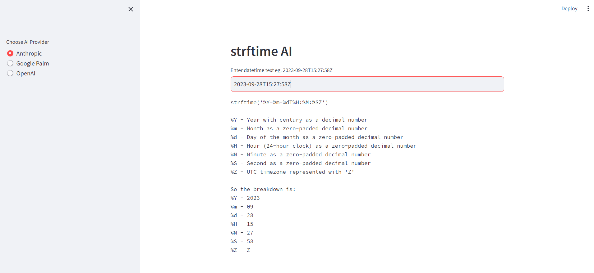

A simple app to convert any datetime string into strftime string using AI

### Try online
[https://strftime-ai.streamlit.app/](https://strftime-ai.streamlit.app/)

### Installation
* Clone the Repository `git clone https://github.com/kneelesh48/strftime-ai.git`
* Install required packages `pip install -r requirements.txt`
* Copy `.env.example` to `.env` and add your OpenAI, Anthropic and Google Palm API keys

### Run
* Execute `streamlit run app.py` in the terminal
